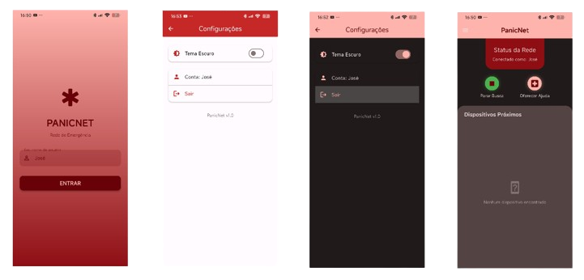
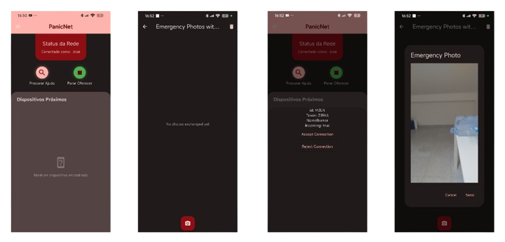
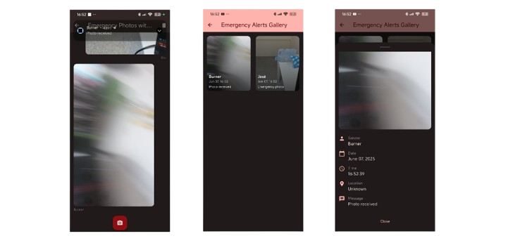

# PanicNet

<p align="center">
  
  <h1 align="center">PanicNet SOS app - Flutter project for ICM classes</h1>
  
  
  
</p>
<hr/>

## About the project
PanicNet is a mobile application designed to assist individuals in emergency situations. The app provides users with a simple and effective way to send SOS alerts to the nearby phones, allowing them to quickly seek help when needed. The app is built using Flutter, a popular open-source UI software development toolkit, and is designed to be user-friendly and intuitive.

## Structure
```
.
├── README.md
└── panicnet
    ├── android
    ├── assets
    ├── build
    ├── ios
    ├── lib
    ├── linux
    ├── macos
    ├── pubspec.yaml
    ├── test
    ├── web
    └── windows
```
The `panicnet` directory holds the **Flutter Project** itself.

## Architecture


## How to run the project

1. Install the dependencies:
    ```bash
    flutter pub get
    ```
2. Run the application:
    ```bash
    flutter run
    ```
